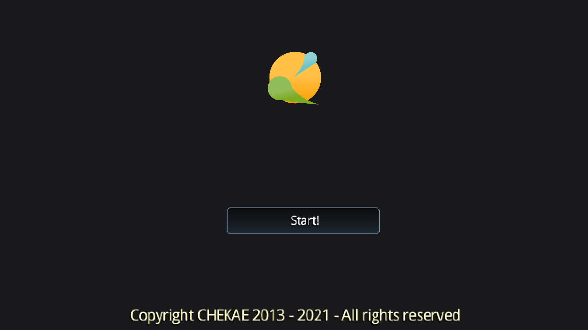
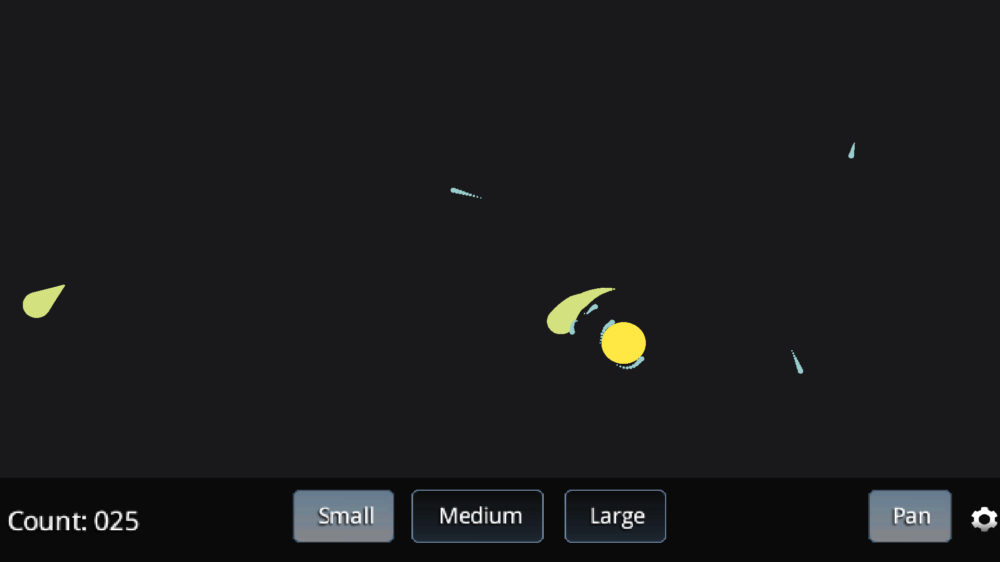
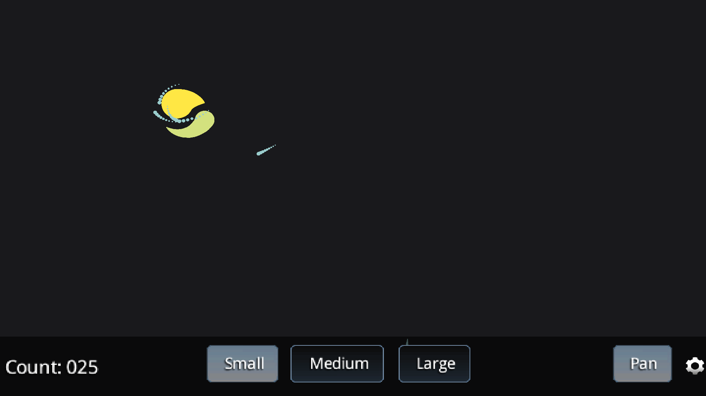
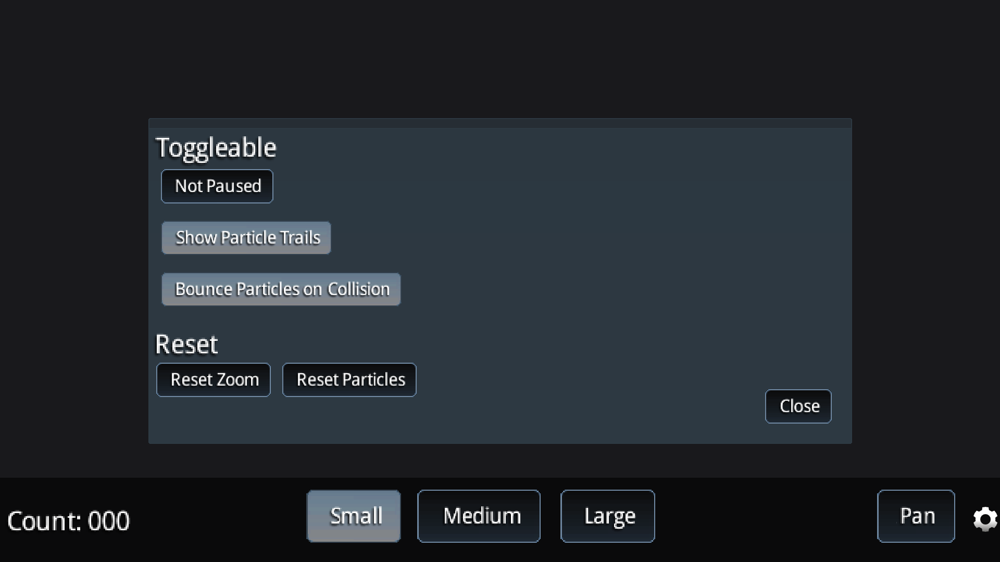

# GLXY

A simplified gravity simulator for Android, built with [libgdx](http://libgdx.badlogicgames.com/).

# Building

You can build it using gradle or Android Studio.

# Controls

## Touch gestures supported:
- Single tap: Create a new particle.
- Double tap: Put camera focus on a particle.
- Pinch: Zoom the view.
- Pan: If panning is enabled, it will pan the view.
       Otherwise, it will create a particle with momentum.

## Option bar:
- Small, Medium, Large buttons: Choose a particle size.
- Pan button: Toggle pan/slingshotting particles.

## Settings menu (cog icon):
- Pause: Toggle pause.
- Particle trails: Show / don't show.
- Collision mode: Bounce / merge particles.
- Reset zoom: Resets the zoom to default.
- Reset particles: Removes all the particles from the field.

# Screenshots
 

 

# Donate

